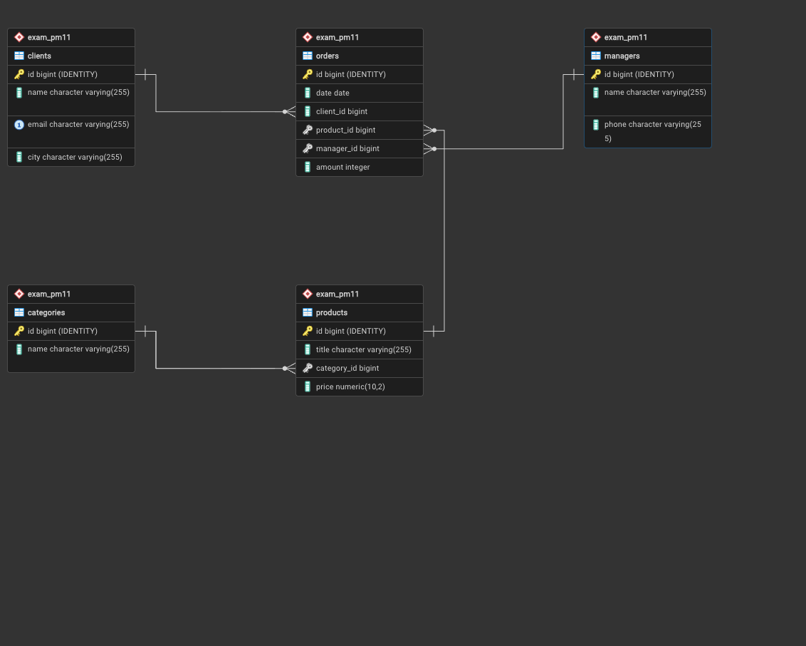

# Exam DB

## Задание

Перед вами таблица с данными интернет-магазина. В ней намеренно допущены нарушения нормальных форм.

Ваша задача — привести её к Третьей нормальной форме (3НФ), разбив на отдельные таблицы и устранить все избыточности.

Исходная таблица: Заказы

[Исходная таблица](https://docs.google.com/spreadsheets/d/1i98mulH0O9haplGiijEFjKkTLbwpbDC7LpOuKo2pb6k/edit?gid=0#gid=0)

Время выполнения: 4 часа 45 минут

Что нужно сделать
- Определить нарушения нормальных форм.
- Разбить исходную таблицу на нормализованные таблицы — дать каждой имя, перечислить поля (английские названия), указать первичные (PK) и внешние ключи (FK) в поле соответствующей ячейки с названием.
- Заполнить каждую таблицу данными на основе исходных записей.
- Приложить ссылку (google sheets) на нормализованные таблицы к ответу.

## Схема

## Допущения
- created_at используется как дата создания записи, 
  order_date — как фактическая дата оформления заказа

## Файлы
- [DDL скрипт](sql/schema.sql)
- [Данные](sql/data.sql)

## Результат
