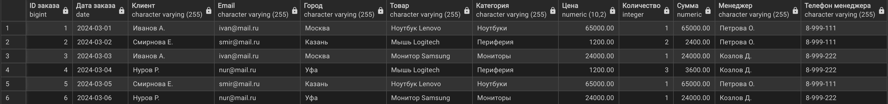

# Exam DB PM.11

## Задание

Возьми готовый список таблиц ниже и построй ER-диаграмму.

[Список таблиц](https://docs.google.com/spreadsheets/d/1i1DOBYIDiUqVJtz9Z7FzrUNtIjggWPy0ZgOCnAIolKY/edit?gid=0#gid=0)

Время выполнения: 4 часа 45 минут

Что нужно сделать
- Нарисовать ER-диаграмму — с помощью pgAdmin или инструмента https://app.chartdb.io/.
- Выгрузить диаграму в формат .png / .jpeg.
- Приложить изображение к ответу на задание (или ссылку на общий доступ к диаграмме).

## Схема

## Допущения
- Первичные ключи определены как `bigint GENERATED ALWAYS AS IDENTITY` 
  вместо устаревшего `serial` — это современный стандарт PostgreSQL 
  для автоинкрементируемых идентификаторов

## Файлы
- [DDL скрипт](sql/schema.sql)
- [Данные](sql/data.sql)

## Результат
